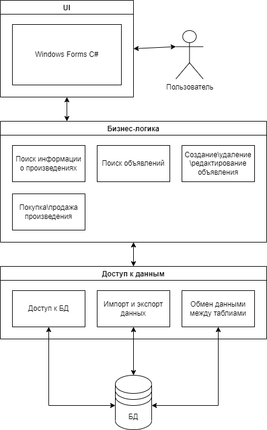
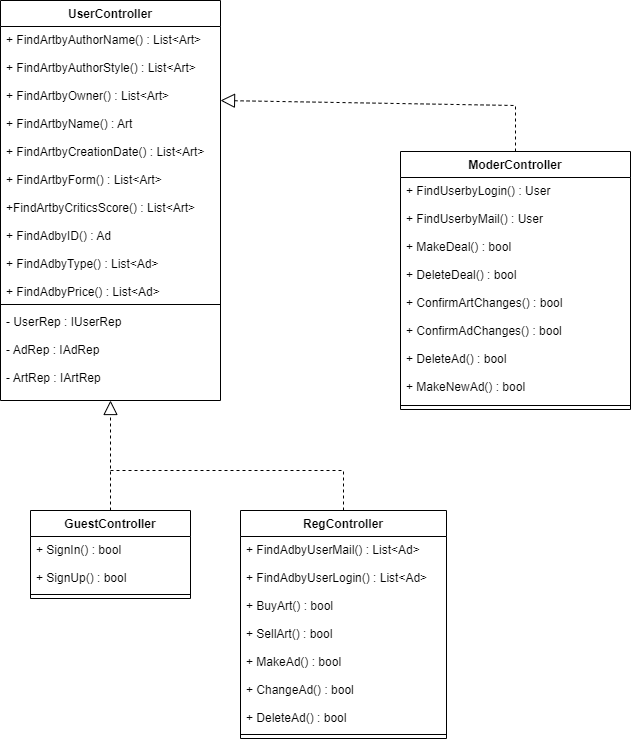
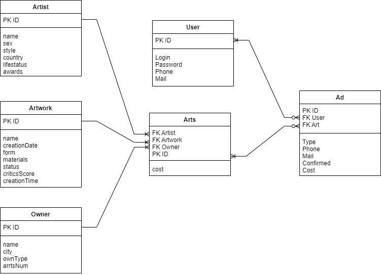

# Лабораторная работа 2
## Описание типа приложения и выбранного технологического стека (Console App/Desktop/Mobile/Web MPA/ Web SPA/Cross-platform)
Тип приложения - Desktop.

Технологический стек - PostgreSQL, C#, Windows Forms C#.

|                                       |Oracle|MySQL|PostgreSQL|
|:--------------------------------------|:----:|:---:|:--------:|
|Простота                               |+     |+    |+         |
|Бесплатно                              |-     |+    |+         |
|Безопасность данных                    |+     |-    |+         |
|Поддержка хранимых процедур и триггеров|+     |+    |+         |
|Кроссплатформенность                   |+     |+    |+         |

## Верхнеуровневое разбиение на компоненты

## UML диаграммы классов для двух отдельных компонентов - компонента доступа к данным и компонента с бизнес-логикой
### Компонент доступа к данным

### Компонент с бизнес-логикой

## UML диаграммы «модельных» классов сущностей: сущности базы данных, сущности системы и транспортные сущности

